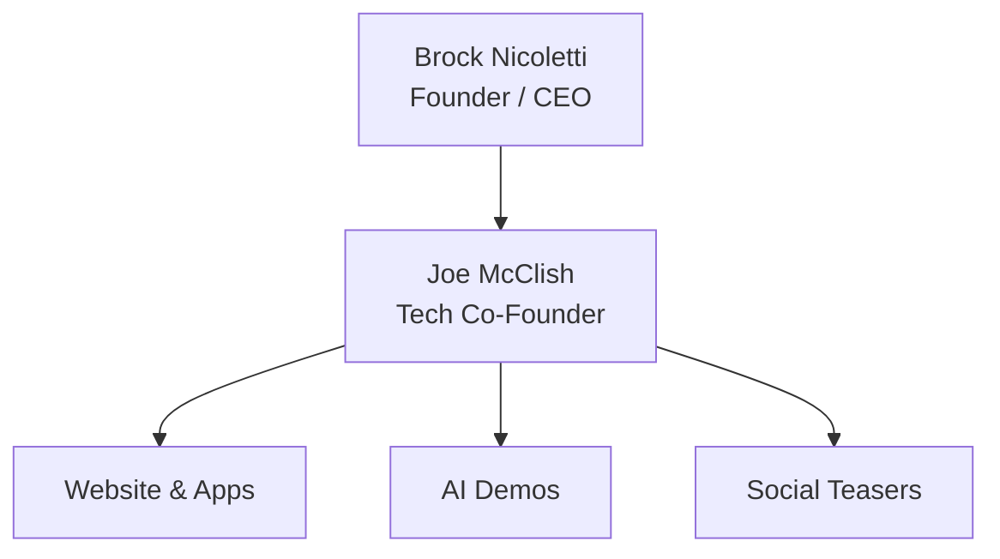

# Garden City Intelligence

**Mission:** Help Missoulians save 2 hrs/week with tech hacks.

---

## Organization Chart (Current)

Future roles: Marketing Lead • AI Specialist
---
## Next Actions (Kanban)

**To Do**  
- [ ] Buy gardencityintelligence.com (Namecheap)  
  [Issue #1](https://github.com/KenKennedyKen/garden-city-intelligence/issues/1)  
- [ ] Set up Google Workspace email (brock@…)  
- [ ] Build website (1-page on Carrd site?) (DIY?)  
- [ ] Draft IG teasers   
- [ ] Open LLC bank account   
- [ ] Schedule first $49 Zoom session  

**In Progress**  
- IG/FB/LinkedIn presence  

**Done**  
- ✅ Create repo & README  
- ✅ Invite Joe as collaborator  
- ✅ Get EINs  

Click any [Issue #] to assign or comment.

---

## Roadmap

| Phase | Tasks | Owner | Status | Due |
|-------|--------|--------|--------|------|
| 1. Foundation | Domain • Email • 1-page site | Brock | Done | Nov 8 |
| 2. Presence | IG/FB/LI • 3× teasers/week | Joe | In Progress | Nov 15 |
| 3. MVP Launch | $49 Zoom • Calendly + Stripe | Brock | To Do | Nov 22 |
| 4. Scale | $29/mo Tip Club • Corporate gigs | Both | Not Started | Dec |

---

## 30 Tech-Hack Ideas

See: `docs/ideas.xlsx`

---

## Links

- Site: gardencityintelligence.com *(coming soon)*
- Book: calendly.com/gci
- Instagram: [@gardencityai](https://instagram.com/gardencityai)
